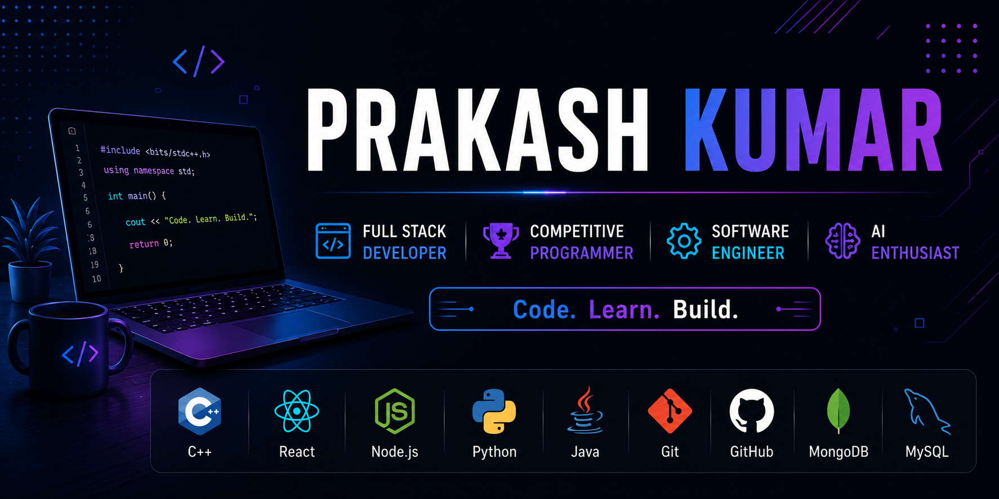

  

<h2 align="center">Software Engineer • Competitive Programmer • Full Stack Developer</h2>

<h1 align="center">Open Source Learner</h1>

  

  

  

  

 
 
## 🚀 About Me

<table>
<tr>
<td width="65%">

🎓 **B.Tech in Information Technology**  
🏫 Rajkiya Engineering College, Banda

💻 Passionate about **Data Structures & Algorithms**, **Competitive Programming**, and **Full Stack Development**.

🌱 Currently learning:
- Advanced DSA
- React.js
- AI & Machine Learning

🎯 Goals:
- Solve 1000+ DSA Problems
- Contribute to Open Source
- Build Scalable Projects
- Crack Top Software Roles

⚡ Fun Fact:
> I enjoy transforming ideas into real-world applications through code.

</td>

<td width="35%">

</td>
</tr>
</table>

## 🛠️ Tech Stack and Tools

### 💻 Languages

<b>C++</b> &nbsp;&nbsp;&nbsp;&nbsp;&nbsp;
<b>Java</b> &nbsp;&nbsp;&nbsp;&nbsp;&nbsp;
<b>Python</b> &nbsp;&nbsp;&nbsp;&nbsp;&nbsp;
<b>JavaScript</b>

---

### 🎨 Frontend

<b>HTML5</b> &nbsp;&nbsp;&nbsp;&nbsp;
<b>CSS3</b> &nbsp;&nbsp;&nbsp;&nbsp;
<b>React</b> &nbsp;&nbsp;&nbsp;&nbsp;
<b>Tailwind CSS</b>

---

### ⚙️ Backend & Database

<b>Node.js</b> &nbsp;&nbsp;&nbsp;
<b>Express</b> &nbsp;&nbsp;&nbsp;
<b>MongoDB</b> &nbsp;&nbsp;&nbsp;
<b>MySQL</b>

---

### 🧰 Tools

<b>Git</b> &nbsp;&nbsp;&nbsp;&nbsp;
<b>GitHub</b> &nbsp;&nbsp;&nbsp;&nbsp;
<b>VS Code</b> &nbsp;&nbsp;&nbsp;&nbsp;
<b>Figma</b>

## 📊 GitHub Analytics

<table align="center">
<tr>
<td align="center">

  
</td>
</tr>
</table>

## 🚀 Featured Projects

<table>
<tr>

<td width="50%" valign="top">

### 🩺 HealthOS

An AI-powered healthcare platform focused on intelligent patient management, appointment scheduling, and smart health assistance.

**Tech Stack:** `React` `Node.js` `Express` `MongoDB`

✨ Features
- AI-powered health assistance
- Secure authentication
- Responsive dashboard
- Modern UI/UX

</td>

<td width="50%" valign="top">

### 🤖 Future Self

A productivity and self-growth application that helps users visualize future goals using AI insights and habit tracking.

**Tech Stack:** `React` `Node.js` `MongoDB`

✨ Features
- AI goal visualization
- Habit tracking
- Progress analytics
- Daily motivation

</td>

</tr>

</table>

## 🚀 Leadership & Community

- 👨‍💼 **Coordinator** @ Student Developer Club (SDC)
- 🎯 Organized technical workshops and coding events
- 🤝 Mentored juniors in **DSA** and **Web Development**
- 🌱 Building a collaborative developer community

---
## 🌐 Connect With Me

---

### ⭐ Thanks for visiting my profile!

*"Code. Learn. Build. Repeat."* 🚀

